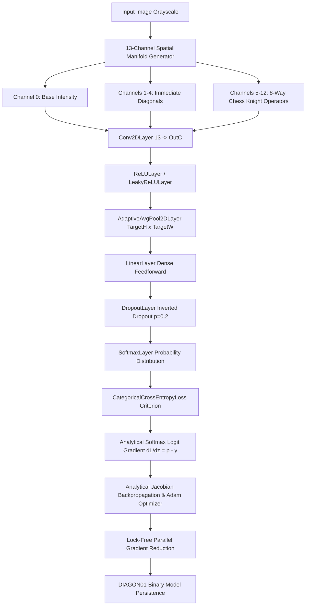

# DiagonNet (`diagonalnet`)

[](go.mod)
[-brightgreen)](STDLIB.md)
[](main_test.go)
[](README.md)

> **Pure Go Zero-Dependency Deep Learning Engine, 13-Channel Spatial Difference Manifold Calculus & High-Performance CPU Runtime.**

GitHub Repository: [https://github.com/itznan/diagonalnet](https://github.com/itznan/diagonalnet)

---

## Table of Contents

- [Overview](#overview)
- [Zero-Dependency Philosophy](#zero-dependency-philosophy)
- [Completed Architecture & Capabilities](#completed-architecture--capabilities)
  - [1. Hardware Topology & Multi-Core Concurrency](#1-hardware-topology--multi-core-concurrency)
  - [2. Contiguous 1D/3D Tensor Engine](#2-contiguous-1d3d-tensor-engine)
  - [3. Trainable Parameter Abstraction & He Initialization](#3-trainable-parameter-abstraction--he-initialization)
  - [4. Lock-Free Parallel Gradient Reduction](#4-lock-free-parallel-gradient-reduction)
  - [5. Binary Weight Serialization (`DIAGON01`)](#5-binary-weight-serialization-diagon01)
  - [6. 13-Channel Spatial Difference Manifold Calculus](#6-13-channel-spatial-difference-manifold-calculus)
  - [7. Neural Network Layers & Analytical Jacobian Autograd](#7-neural-network-layers--analytical-jacobian-autograd)
  - [8. Dual-Mode CLI Routing Subsystem](#8-dual-mode-cli-routing-subsystem)
- [Unit Testing & Numerical Gradient Verification](#unit-testing--numerical-gradient-verification)
- [Project Directory Structure](#project-directory-structure)
- [Getting Started & CLI Usage](#getting-started--cli-usage)
  - [Build](#build)
  - [Run Test Suite](#run-test-suite)
  - [CLI Commands](#cli-commands)
  - [Verify Zero Dependencies](#verify-zero-dependencies)
- [Standard Library Replacements](#standard-library-replacements)

---

## Overview

**DiagonNet** is an autonomous, high-performance deep learning engine implemented from scratch in **100% pure Go standard library** without any external dependencies, C bindings, or third-party packages.

The engine leverages analytical Jacobian backpropagation, custom 13-channel spatial difference manifold feature extraction (incorporating immediate diagonal and 8-way chess knight-move operators), contiguous L1/L2 cache-friendly tensors, and lock-free multi-core CPU parallelism.

---

## Zero-Dependency Philosophy

DiagonNet does not rely on PyTorch, TensorFlow, OpenCV, NumPy, scikit-learn, or external web frameworks. Every layer, matrix operation, statistical routine, image manifold transformation, binary weight serializer, and concurrency primitive is built natively with the Go Standard Library (`math`, `sync`, `runtime`, `encoding/binary`, `encoding/json`, `bufio`, `os`, `flag`).

---

## Completed Architecture & Capabilities



### 1. Hardware Topology & Multi-Core Concurrency
- **Multi-Core Diagnostics**: Automatic system hardware topology detection using `runtime.NumCPU()` and `runtime.GOMAXPROCS`.
- **Worker Scaling**: Dynamic scaling across available CPU cores for zero-contention parallel workload distribution (`NumWorkers()`).
- **Interactive Startup Banner**: Displays CPU compute engine core utilization, OS, target architecture, and Go version.

### 2. Contiguous 1D/3D Tensor Engine
- **Flat Memory Layout**: Multi-dimensional 3D tensors `[C x H x W]` backed by contiguous 1D `[]float32` slices to optimize CPU L1/L2 cache locality and prevent pointer chasing.
- **Constant-Time Stride Indexing**:
  $$\text{Index}(c, y, x) = c \times (H \times W) + y \times W + x$$
- **Core Tensor Methods**: Allocation (`NewTensor`), coordinate accessors (`Get`, `Set`), fast zeroing (`Zero`), size calculation (`Size`), deep copying (`Clone`), and shape queries (`Shape`).

### 3. Trainable Parameter Abstraction & He Initialization
- **Parameter Struct**: Unified memory encapsulation containing trainable weights (`Data`), analytical Jacobian gradient buffers (`Grad`), and Adam first/second moment accumulators (`M`, `V`).
- **Kaiming Uniform (He Uniform)**:
  $$\text{bound} = \sqrt{\frac{6}{\text{fan\_in}}}, \quad W \sim \mathcal{U}(-\text{bound}, +\text{bound})$$
- **Kaiming Normal (He Normal)**:
  $$\sigma = \sqrt{\frac{2}{\text{fan\_in}}}, \quad z = \sigma \cdot \sqrt{-2 \ln u_1} \cos(2\pi u_2) \quad \text{(Box-Muller transform)}$$
- **Zero & Constant Initialization**: Helper routines for bias vectors and deterministic unit testing.

### 4. Lock-Free Parallel Gradient Reduction
- **Chunk Partitioning**: Aggregates gradients from parallel worker replicas into master parameters using partitioned contiguous chunks across Goroutines (`ReduceParameterGradients`, `ReduceGradients`).
- **Zero Mutex Contention**: Workers write to non-overlapping master memory slices without locking overhead.

### 5. Binary Weight Serialization (`DIAGON01`)
- **Custom File Format**: Fast, portable binary format with magic header verification (`DIAGON01`).
- **Class Metadata**: JSON-encoded class name metadata header with explicit byte-length prefix.
- **Contiguous Payloads**: Little-endian IEEE 754 `float32` binary serialization (`SaveModelWeights`, `LoadModelWeights`).

### 6. 13-Channel Spatial Difference Manifold Calculus
Transforms a 1-channel grayscale image into a 13-channel spatial difference manifold in parallel across CPU rows:
- **Channel 0**: Base normalized grayscale intensity $I(x, y)$.
- **Channels 1–4 (Immediate Diagonals)**: Absolute directional gradients:
  $$M_k(x, y) = |I(x, y) - I(\text{clamp}(x + dx_k), \text{clamp}(y + dy_k))|$$
  Directions: Top-Left $(-1, -1)$, Top-Right $(+1, -1)$, Bottom-Left $(-1, +1)$, Bottom-Right $(+1, +1)$.
- **Channels 5–12 (8-Way Chess Knight-Move Operators)**:
  $$\mathcal{K} = \{ (-2, -1), (-2, +1), (-1, -2), (-1, +2), (+1, -2), (+1, +2), (+2, -1), (+2, +1) \}$$
- **Parallelization**: Multi-threaded row slicing using `ComputeManifoldIntoSlice` and `ComputeManifoldTensor`.

### 7. Neural Network Layers & Analytical Jacobian Autograd
All layers support pre-allocated memory destinations (`ForwardInto`, `BackwardInto`) for zero-allocation training loops:
- **`Conv2DLayer`**:
  - Multi-channel 2D convolution with configurable kernel size $K$, stride $S$, and padding $P$.
  - Output channel parallelization across worker Goroutines.
  - Full analytical Jacobian backward pass computing weight gradients $\frac{\partial L}{\partial W}$, bias gradients $\frac{\partial L}{\partial B}$, and input feature gradients $\frac{\partial L}{\partial X}$.
- **`ReLULayer` & `LeakyReLULayer`**:
  - **ReLU**: Forward $y_i = \max(0, x_i)$, Backward $\frac{\partial L}{\partial x_i} = \frac{\partial L}{\partial y_i} \cdot \mathbf{1}(x_i > 0)$.
  - **LeakyReLU**: Forward $y_i = x_i \text{ if } x_i > 0 \text{ else } \alpha x_i$, Backward $\frac{\partial L}{\partial x_i} = \frac{\partial L}{\partial y_i} \text{ if } x_i > 0 \text{ else } \alpha \frac{\partial L}{\partial y_i}$ ($\alpha = 0.01$).
  - Full support for 1D slices (`Forward`, `Backward`) and 3D Tensors (`ForwardTensor`, `BackwardTensor`).
- **`SoftmaxLayer` & `Softmax`**:
  - Numerically stable exponentiation via max-logit subtraction: $m = \max_j z_j$, $e_i = \exp(z_i - m)$, $p_i = \frac{e_i}{\sum_j e_j}$.
  - Analytical backward Jacobian: $\frac{\partial L}{\partial z_i} = p_i \left( \frac{\partial L}{\partial p_i} - \sum_j \frac{\partial L}{\partial p_j} p_j \right)$.
- **`CategoricalCrossEntropyLoss`**:
  - Loss formulation: $\mathcal{L} = -\ln(p_{\text{target}} + \epsilon)$ with $\epsilon = 10^{-15}$.
  - Composite analytical gradient w.r.t pre-softmax logits: $\frac{\partial \mathcal{L}}{\partial z_i} = p_i - \mathbf{1}(i = \text{target})$.
- **`AdaptiveAvgPool2DLayer`**:
  - Dynamically pools arbitrary spatial dimensions $[H \times W]$ to a fixed $[TargetH \times TargetW]$ output.
  - Analytical backward pass uniformly distributing gradients across spatial bins.
- **`LinearLayer`**:
  - Dense feedforward layer with vectorized forward matrix-vector math ($y = Wx + b$).
  - Full analytical Jacobian backward pass for weight, bias, and input gradients.
- **`DropoutLayer`**:
  - Inverted Bernoulli dropout regularization (default $p = 0.2$, scaling factor $\frac{1}{1-p} = 1.25$).
  - Exact gradient scaling during training mode and zero-overhead identity passthrough during evaluation mode.

### 8. Dual-Mode CLI Routing Subsystem
- **Flexible Argument Parsing**: Supports both Unix-style command flags and standard positional subcommands:
  - `train` / `-train`: Launch deep learning training pipeline.
  - `serve` / `-serve`: Start the interactive HTTP inference and dashboard runtime.
  - `audit` / `-audit`: Run dataset verification and manifold integrity checks.
  - `benchmark` / `-benchmark`: Run performance and throughput benchmarks.
  - `help` / `-help`: Print usage instructions.

---

## Unit Testing & Numerical Gradient Verification

The test suite in [`main_test.go`](main_test.go) validates all engine components and proves mathematical correctness of analytical Jacobian gradients against finite-difference numerical approximations:

$$\frac{\partial L}{\partial \theta_i} \approx \frac{L(\theta_i + \epsilon) - L(\theta_i - \epsilon)}{2\epsilon} \quad (\epsilon = 10^{-3})$$

### Test Suite Summary

| Test Case | Description | Status |
| :--- | :--- | :---: |
| `TestTensorIndexAndStride` | Stride calculation, index mapping, memory bounds | `PASS` |
| `TestTensorZeroAndClone` | Deep copy isolation and memory zeroing | `PASS` |
| `TestParameterAllocationAndBuffers` | Parameter buffers, Adam moment vectors, cloning | `PASS` |
| `TestKaimingUniformInitialization` | He uniform distribution bounds and mean convergence | `PASS` |
| `TestKaimingNormalInitialization` | Box-Muller Gaussian distribution mean and standard deviation | `PASS` |
| `TestReduceParameterGradients` | Multi-worker parallel chunk gradient reduction | `PASS` |
| `TestReduceGradientsMultiParam` | Multi-parameter gradient accumulation across replicas | `PASS` |
| `TestSaveAndLoadModelWeights` | `DIAGON01` binary serialization roundtrip & metadata | `PASS` |
| `TestClamp` | Spatial coordinate clamping and boundary conditions | `PASS` |
| `TestComputeManifoldSignatureAndParallel` | 13-channel manifold transformation & knight differential checks | `PASS` |
| `TestConv2DLayerForward` | 2D convolution forward spatial mapping and padding logic | `PASS` |
| `TestConv2DLayerBackwardJacobian` | **Numerical gradient verification** for Conv2D weights, bias, & inputs | `PASS` |
| `TestAdaptiveAvgPool2DLayer` | Adaptive pooling spatial binning & gradient distribution | `PASS` |
| `TestLinearLayerForwardAndBackward` | **Numerical gradient verification** for Linear weights, bias, & inputs | `PASS` |
| `TestDropoutLayer` | Inverted dropout Bernoulli mask, scaling, & gradient scaling | `PASS` |
| `TestReLUScalar` | Scalar ReLU function and analytical derivative checks | `PASS` |
| `TestReLULayerForwardAndBackward` | **Numerical gradient verification** for ReLU layer forward & backward | `PASS` |
| `TestReLULayerTensor` | ReLU forward and analytical backward passes on 3D Tensors | `PASS` |
| `TestLeakyReLUScalar` | Scalar LeakyReLU function and analytical derivative checks | `PASS` |
| `TestLeakyReLULayerForwardAndBackward` | **Numerical gradient verification** for LeakyReLU layer forward & backward | `PASS` |
| `TestLeakyReLULayerTensor` | LeakyReLU forward and analytical backward passes on 3D Tensors | `PASS` |
| `TestSoftmaxBasic` | Standard Softmax probabilities, monotonicity, and unit sum constraint | `PASS` |
| `TestSoftmaxNumericalStability` | Overflow resilience on extreme logits (no NaNs or Infs) | `PASS` |
| `TestSoftmaxLayerForwardAndBackward` | **Numerical gradient verification** for Softmax analytical Jacobian | `PASS` |
| `TestCategoricalCrossEntropyValues` | Cross-Entropy scalar loss evaluation and boundary safety ($\epsilon = 10^{-15}$) | `PASS` |
| `TestCategoricalCrossEntropyOneHot` | Consistency between one-hot distribution and scalar class index loss | `PASS` |
| `TestSoftmaxCrossEntropyAnalyticalGradients` | **Numerical gradient verification** for composite Softmax logit gradients | `PASS` |

---

## Project Directory Structure

```text
C:\diagonalnet\
├── .gitignore              # Comprehensive enterprise ignore rules
├── README.md               # Project documentation and architecture guide
├── STDLIB.md               # Standard library replacements & technical rationale
├── go.mod                  # Pure Go 1.27.0 module definition (zero dependencies)
├── main.go                 # Engine core, tensor math, layers, autograd, CLI
├── main_test.go            # Comprehensive test suite & numerical gradient checks
├── verify_deps.bat         # Dependency audit verification script
├── push.bat                # Git push automation script
├── pull.bat                # Git pull automation script
├── assets/                 # Visual assets and documentation diagrams
├── bin/                    # Compiled binary outputs (diagonnet.exe)
├── data/                   # Dataset storage directory
└── weights/                # Serialized DIAGON01 binary model weights
```

---

## Getting Started & CLI Usage

### Build

Compile the native binary using the Go standard toolchain:

```bash
go build -o bin/diagonnet.exe .
```

### Run Test Suite

Run the full unit test suite with verbose output:

```bash
go test -v ./...
```

### CLI Commands

```bash
# Display help and usage instructions
diagonnet help
# or: diagonnet -help

# Audit dataset structure and verify sample integrity
diagonnet audit -data data
# or: diagonnet -audit -data data

# Train deep learning model
diagonnet train -data data -model weights/diagonnet_model.bin -epochs 10 -lr 0.002 -batch 64
# or: diagonnet -train -data data -epochs 10 -lr 0.002 -batch 64

# Start interactive HTTP dashboard and inference server
diagonnet serve -model weights/diagonnet_model.bin -port 8081
# or: diagonnet -serve -port 8081

# Run manifold and standard benchmark suite
diagonnet benchmark -data data
# or: diagonnet -benchmark
```

### Verify Zero Dependencies

Run the dependency verification script to confirm zero external third-party dependencies:

```cmd
verify_deps.bat
```

Output:
```text
====================================================
 DiagonalNet Zero-Dependency Verification
====================================================

[1] Checking active Go modules:
diagonnet

[2] Checking external non-standard library dependencies:
bufio
encoding/binary
encoding/json
errors
flag
fmt
io
math
math/rand
os
path/filepath
runtime
strings
sync
testing

Module is 100% pure Go standard library with zero third-party dependencies.
```

---

## Standard Library Replacements

For complete details on how DiagonNet eliminates heavyweight third-party packages, see [STDLIB.md](STDLIB.md):

| # | Package Normally Used | Category | Standard Library Replacement in DiagonNet |
| :-: | :--- | :--- | :--- |
| 1 | `PyTorch` / `TensorFlow` / `LibTorch` | Deep Learning Engine & Autograd | Handcrafted contiguous tensors, analytical backpropagation Jacobian engine |
| 2 | `pandas` / `polars` | Tabular DataFrames & Profiling | Custom dataset parsing using `encoding/csv`, `strconv`, `math`, `sort` |
| 3 | `scikit-learn` (`StandardScaler`, `OneHotEncoder`) | Feature Preprocessing | Native normalization, min/max scaling, and one-hot encoding |
| 4 | `scikit-learn` (`metrics`) | Model Evaluation Metrics | Native confusion matrix, precision, recall, Macro-F1, MSE, MAE, R² |
| 5 | `scikit-learn` (`datasets`) | Benchmark Datasets | Embedded string constants and synthetic mathematical manifold generators |
| 6 | `torchvision.datasets.ImageFolder` | Vision Dataset Loader | Recursive scanning via `os.ReadDir`, `path/filepath`, and `sort` |
| 7 | `OpenCV` (`cv2`) / `Pillow` | Computer Vision & Image Processing | `image`, `image/color`, `image/draw`, `image/png`, `image/jpeg` |
| 8 | `torch.optim.Adam` / `SGD` | Optimization Algorithms | Moment tracking with `math.Sqrt` and LittleEndian accumulators |
| 9 | `CUDA` / `OpenMP` | Multithreading & Parallelism | `sync.WaitGroup`, Go goroutines, and `runtime.NumCPU()` |
| 10 | `Flask` / `FastAPI` / `Express` | Web Backend & REST API | `net/http` and `encoding/json` |
| 11 | `Chart.js` / `D3.js` / `Plotly` | Live Training Curves & Charts | Inline dynamic SVG paths and native HTML5 Canvas |
| 12 | `ONNX` / `Pickle` / `SafeTensors` | Model Serialization | Custom `DIAGON01` binary format with `encoding/binary` |
| 13 | `Albumentations` | Data Augmentation | Native matrix pixel transforms, 2D rotations, and coordinate shifts |

---

## License

MIT License. Designed and engineered from scratch in pure Go.

