# DiagonNet (`diagonalnet`)

[](go.mod)
[-brightgreen)](STDLIB.md)
[](main_test.go)
[](README.md)

> **Pure Go Zero-Dependency Deep Learning Engine, 13-Channel Spatial Difference Manifold Calculus & High-Performance CPU Runtime.**

GitHub Repository: [https://github.com/itznan/diagonalnet](https://github.com/itznan/diagonalnet)

---

## Table of Contents

- [Overview](#overview)
- [Zero-Dependency Philosophy](#zero-dependency-philosophy)
- [Problem & Solution Matrix](#problem--solution-matrix)
- [Completed Architecture & Capabilities](#completed-architecture--capabilities)
  - [1. Hardware Topology & Multi-Core Concurrency](#1-hardware-topology--multi-core-concurrency)
  - [2. Contiguous 1D/3D Tensor Engine](#2-contiguous-1d3d-tensor-engine)
  - [3. Trainable Parameter Abstraction & He Initialization](#3-trainable-parameter-abstraction--he-initialization)
  - [4. Adam Optimizer & Step Learning Rate Decay Scheduler](#4-adam-optimizer--step-learning-rate-decay-scheduler)
  - [5. Lock-Free Parallel Gradient Reduction](#5-lock-free-parallel-gradient-reduction)
  - [6. Binary Weight Serialization (`DIAGON01`)](#6-binary-weight-serialization-diagon01)
  - [7. Dataset Scanner, Grayscale Loading, Stratified Splitting & Health Auditor](#7-dataset-scanner-grayscale-loading-stratified-splitting--health-auditor)
  - [8. Bounding Box, Contrast Stretching, Resampling & 15x Augmentation](#8-bounding-box-contrast-stretching-resampling--15x-augmentation)
  - [9. 13-Channel Spatial Difference Manifold Calculus](#9-13-channel-spatial-difference-manifold-calculus)
  - [10. Neural Network Layers & Analytical Jacobian Autograd](#10-neural-network-layers--analytical-jacobian-autograd)
  - [11. Data-Parallel BatchTrainer & Model Architecture](#11-data-parallel-batchtrainer--model-architecture)
  - [12. Best-Model Checkpointing & Multi-Class Evaluation Metrics](#12-best-model-checkpointing--multi-class-evaluation-metrics)
  - [13. Architecture Benchmark Runner (DiagonNet vs CNN vs MLP)](#13-architecture-benchmark-runner-diagonnet-vs-cnn-vs-mlp)
  - [14. Real-Time Web Server, Embedded Canvas UI & REST API](#14-real-time-web-server-embedded-canvas-ui--rest-api)
  - [15. Dual-Mode CLI Routing Subsystem](#15-dual-mode-cli-routing-subsystem)
- [Unit Testing & Numerical Gradient Verification](#unit-testing--numerical-gradient-verification)
- [Project Directory Structure](#project-directory-structure)
- [Getting Started & CLI Usage](#getting-started--cli-usage)
  - [Build](#build)
  - [Run Test Suite](#run-test-suite)
  - [CLI Commands](#cli-commands)
  - [Verify Zero Dependencies](#verify-zero-dependencies)
- [Standard Library Replacements](#standard-library-replacements)

---

## Overview

**DiagonNet** is an autonomous, high-performance deep learning engine implemented from scratch in **100% pure Go standard library** without any external dependencies, C bindings, or third-party packages.

The engine leverages analytical Jacobian backpropagation, custom 13-channel spatial difference manifold feature extraction (incorporating immediate diagonal and 8-way chess knight-move operators), contiguous L1/L2 cache-friendly tensors, and lock-free multi-core CPU parallelism.

---

## Zero-Dependency Philosophy

DiagonNet does not rely on PyTorch, TensorFlow, OpenCV, NumPy, scikit-learn, or external web frameworks. Every layer, matrix operation, statistical routine, image manifold transformation, binary weight serializer, and concurrency primitive is built natively with the Go Standard Library (`math`, `sync`, `runtime`, `encoding/binary`, `encoding/json`, `bufio`, `os`, `flag`).

---

## Problem & Solution Matrix

| # | Technical Challenge & Block | Engineering Solution in DiagonNet |
| :-: | :--- | :--- |
| 1 | **Heavyweight Framework Dependency Hell & Deployment Bloat**<br>Standard ML stacks require gigabytes of Python packages (`torch`, `tensorflow`, `cv2`, `numpy`, `sklearn`), dynamic linkers, and C++ shared runtimes, creating fragile deployments, massive memory footprints, and security audit hurdles. | **100% Pure Go Zero-Dependency Core**<br>Every tensor operation, layer, Jacobian backpropagation pass, optimizer, and I/O serializer is written from scratch using only the Go standard library, producing a single, self-contained, high-performance static binary (<3 MB). |
| 2 | **Hardcoded Classes & Rigid Dataset Topologies**<br>Traditional codebases hardcode label arrays and class counts, failing when applied to novel datasets or varying category numbers. | **Dataset-Agnostic Filesystem Scanner & Dynamic Two-Way Mapping**<br>Automatically discovers classes from filesystem subdirectories (`data/*`), builds deterministic two-way $0 \dots K-1$ bi-directional mappings (`ClassToIdx`, `IdxToClass`), and configures the classification head dynamically to $K$ classes. |
| 3 | **Dataset Class Imbalance & Skewed Validation Sets**<br>Standard random train/test splitting leads to severe class distribution disparities, unrepresentative validation sets, and skewed metrics. | **Stratified Train / Validation Splitter**<br>Groups items by class label and extracts $\lfloor N_c \cdot \text{testRatio} \rfloor$ samples per class, guaranteeing perfectly balanced representation across splits with deterministic pseudo-random shuffling. |
| 4 | **Corrupt, Blank, and Tiny Drawing Artifacts**<br>Dataset anomalies (corrupt files, 100% blank scans, tiny 5-pixel outlier marks) silently pollute training gradients and degrade classification performance. | **Automated Dataset Health & Quality Auditor (`-audit`)**<br>Computes foreground stroke statistics, detects corrupt/blank/tiny outliers, evaluates average bounding boxes, aspect ratios, and stroke densities, and prints formatted diagnostic tables. |
| 5 | **Resolution & Canvas Scale Domain Gap**<br>Sketches drawn on wide web canvases ($400\text{px}$) vs small dataset icons ($20\text{px}$) cause distribution shifts and classification failures. | **Scale-Invariant Proportional Padding & Centering**<br>Locates the tight foreground bounding box ($>10$ luminosity), calculates dynamic margin $\text{pad} = \max(2, \lfloor 0.22 \times D \rfloor)$, and centers into an $S \times S$ square canvas, ensuring foreground always occupies $\approx 70\%$ of canvas area. |
| 6 | **Faint & Inconsistent Stroke Luminosity**<br>Variable stylus pressure or light sketching creates faint, low-contrast drawings that under-activate neural activations. | **Peak Stroke Luminosity Contrast Stretching**<br>Measures peak foreground luminosity $L_{\max}$; if $30 < L_{\max} < 240$, adaptively rescales intensities via $y' = \min(255, \text{round}(y \cdot 255.0 / L_{\max}))$. |
| 7 | **Sub-Pixel Grid Aliasing & Distortion**<br>Discrete nearest-neighbor resizing produces jagged stroke edges and loss of diagonal manifold features. | **Sub-Pixel Bilinear Interpolation Resampling**<br>Resamples images to standard grid ($100 \times 100$) using continuous half-pixel shifted coordinates $(x+0.5)\frac{W_s}{W_t} - 0.5$ and 4-neighbor bilinear weighting. |
| 8 | **Training Overfitting & Stroke Invariance Gaps**<br>Limited hand-drawn datasets lack variety in stroke thickness, hand slant, orientation, and spatial offsets. | **15-Variant Comprehensive Data Augmentor**<br>Generates 15 continuous geometric and morphological variants per sample: rotations ($\pm 10^\circ, \pm 15^\circ$), 2D directional shifts, horizontal slant shear ($\pm 0.20$), dilation thickening, and erosion thinning. |
| 9 | **Multi-Core CPU Bottleneck in Single-Threaded Backprop**<br>Sequential sample-by-sample forward and backward passes leave 90%+ of modern multi-core CPU capacity idle. | **Data-Parallel BatchTrainer & Worker Replicas**<br>Spawns $N = \text{runtime.NumCPU()}$ model replicas, partitions batches of size $B$ into $\lceil B/N \rceil$ slices, computes concurrent backward passes, and reduces gradients in parallel. |
| 10 | **Late-Epoch Overfitting & Weight Degradation**<br>Extended training often overfits late in the schedule, degrading generalization performance past the optimal validation epoch. | **Best-Model Validation Accuracy Checkpointing**<br>Tracks validation accuracy across epochs, snapshots weights when a new best accuracy is achieved, and restores optimal parameters prior to model serialization. |
| 11 | **Single-Metric Accuracy Evaluation Blindness**<br>Standard accuracy metrics hide class-specific failure modes, precision-recall trade-offs, and class imbalance artifacts. | **Comprehensive Multi-Class Confusion & F1 Profiler**<br>Calculates per-class $TP, FP, FN, \text{Precision}, \text{Recall}, \text{F1-Score}$, macro-averages, and formatted ASCII confusion tables. |
| 12 | **Spatial & Directional Representation Bottleneck**<br>Standard 1-channel or 3-channel convolutional architectures struggle to capture non-local diagonal textures and discrete spatial derivatives without deep networks. | **13-Channel Spatial Difference Manifold Calculus**<br>Precomputes an analytical 13-channel manifold comprising base grayscale intensity ($Ch_0$), 4 immediate diagonal differential operators ($Ch_{1-4}$), and all 8 chess knight-move differential operators ($Ch_{5-12}$) in parallel across CPU rows. |
| 13 | **Architectural Ablation & Baseline Evaluation Vacuum**<br>Measuring deep learning innovation requires rigorous head-to-head empirical comparison against standardized baseline architectures on identical data partitions. | **Automated Multi-Model Architecture Benchmark Runner (`--benchmark`)**<br>Benchmarks DiagonNet against baseline 1-channel CNN (`SimpleCNN`) and dense MLP (`SimpleMLP`), training each for identical epochs, outputting comparative ASCII summary tables and exporting to `assets/comparison_results.csv`. |
| 14 | **Clunky Web Serving & Third-Party UI Framework Overhead**<br>Serving deep learning models typically requires bloated Node.js/React frontends, separate Python Flask/FastAPI backends, and CORS proxy headaches. | **Self-Contained Embedded HTML5 Canvas Web App & REST API (`-serve`)**<br>Embeds an entire single-page dark-themed drawing canvas web app directly into Go binary with real-time `<8ms` prediction REST API (`/api/predict`), metadata introspection (`/api/info`), and automatic multi-OS browser launching. |
| 15 | **Softmax Floating-Point Overflow & NaN Hazards**<br>Computing $\exp(z_i)$ directly causes IEEE-754 single-precision overflow ($+\infty$) and `NaN` values whenever logits exceed $\approx 88.7$. | **Max-Logit Subtracted Stable Exponentiation**<br>Subtracts the maximum logit $m = \max_j z_j$ prior to exponentiation ($e_i = \exp(z_i - m)$), guaranteeing mathematical invariance, bounded exponents ($\le 0$), and zero overflow risks. |
| 16 | **Cross-Entropy Zero-Probability Singularity**<br>When model predicts $p_{\text{target}} = 0$, $-\ln(0)$ yields $-\infty$ (or NaN) during training loss computation. | **Epsilon-Bounded Categorical Cross-Entropy**<br>Applies strict boundary stabilization $-\ln(p_{\text{target}} + 10^{-15})$ coupled with direct analytical pre-softmax logit gradients $\frac{\partial \mathcal{L}}{\partial z_i} = p_i - \mathbf{1}(i = \text{target})$. |
| 17 | **Initial Adam Step Bias & Weight Explosion**<br>Exponential moving averages of 1st and 2nd moments ($m_t, v_t$) start initialized at zero, causing severe step underestimation in early training epochs, and unconstrained weights lead to overfitting. | **Analytical Bias Corrections & $L_2$ Weight Decay**<br>Applies exact time-step power corrections $\hat{m}_t = \frac{m_t}{1 - \beta_1^t}$ and $\hat{v}_t = \frac{v_t}{1 - \beta_2^t}$ alongside integrated $L_2$ gradient penalty $g_t \leftarrow g_t + \lambda \theta_t$ ($\lambda = 10^{-4}$). |
| 18 | **Fixed Learning Rate Coarse Convergence Stalling**<br>A static learning rate oscillates around local minima in later epochs or converges too slowly in early phases. | **Configurable Step Milestone LR Decay Scheduler**<br>Dynamically scales learning rates across training milestones (e.g. $\alpha_0 = 0.002 \to 50\% \to 25\%$) configurable via external JSON settings files with clean stdout logging. |
| 19 | **CPU Multi-Core Mutex Contention Bottlenecks**<br>Parallel gradient reduction across multiple worker replicas typically suffers from mutex lock contention and false cache sharing. | **Lock-Free Contiguous Chunk Partitioning**<br>Workers write to non-overlapping master memory slices without mutex locks, maximizing CPU L1/L2 cache locality and scaling linearly with logical CPU cores. |
| 20 | **Enterprise Windows AppLocker / Temp Execution Blocks**<br>On enterprise Windows environments, executing test or runtime binaries out of `%TEMP%` (`AppData\Local\Temp`) is blocked by Application Control policies (`An Application Control policy has blocked this file`). | **In-Workspace Local Binary Execution**<br>All binary builds and test runners execute locally within workspace paths (`bin/` or `.`), fully compliant with enterprise security and application control policies. |

---

## Completed Architecture & Capabilities

```mermaid
flowchart TD
    A[Filesystem Scanner data/class_name/*] --> B[Automated Health & Quality Auditor]
    B --> C[Dynamic Bi-Directional Class Mapping K Classes]
    C --> D[Stratified Train/Val Splitter]
    D --> E[Pure Stdlib 8-Bit Grayscale Loader]
    E --> F[Tight Bounding Box Locator]
    F --> G[Scale-Invariant Proportional Padding ~70% Area]
    G --> H[Peak Stroke Luminosity Contrast Stretching]
    H --> I[Sub-Pixel Bilinear Resampling 100x100 Grid]
    I --> J[15-Variant Data Augmentor Rot/Shift/Shear/Morph]
    J --> K[13-Channel Spatial Manifold Generator]
    K --> L[BatchTrainer N Worker Replicas]
    L --> M[Conv2DLayer 13 -> 16 OutC]
    M --> N[ReLULayer Activation]
    N --> O[AdaptiveAvgPool2DLayer 4x4 Output 256 Features]
    O --> P[DropoutLayer Inverted Dropout p=0.2]
    P --> Q[LinearLayer Dense Head 256 -> K Outputs]
    Q --> R[SoftmaxLayer Probability Distribution]
    R --> S[CategoricalCrossEntropyLoss Criterion]
    S --> T[Analytical Softmax Logit Gradient dL/dz = p - y]
    T --> U[Analytical Jacobian Backpropagation]
    U --> V[Lock-Free Parallel Gradient Reduction]
    V --> W[Adam Optimizer & Step LR Scheduler]
    W --> X[ModelCheckpoint Best Validation Restorer]
    X --> Y[Comprehensive Multi-Class Metric Profiler]
    Y --> Z[DIAGON01 Binary Model Persistence]
    Z --> AA[Architecture Benchmark Runner vs SimpleCNN & SimpleMLP]
    AA --> AB[Embedded HTML5 Canvas Web Server & REST API]
```



### 1. Hardware Topology & Multi-Core Concurrency
- **Multi-Core Diagnostics**: Automatic system hardware topology detection using `runtime.NumCPU()` and `runtime.GOMAXPROCS`.
- **Worker Scaling**: Dynamic scaling across available CPU cores for zero-contention parallel workload distribution (`NumWorkers()`).
- **Interactive Startup Banner**: Displays CPU compute engine core utilization, OS, target architecture, and Go version.

### 2. Contiguous 1D/3D Tensor Engine
- **Flat Memory Layout**: Multi-dimensional 3D tensors `[C x H x W]` backed by contiguous 1D `[]float32` slices to optimize CPU L1/L2 cache locality and prevent pointer chasing.
- **Constant-Time Stride Indexing**:
  $$\text{Index}(c, y, x) = c \times (H \times W) + y \times W + x$$
- **Core Tensor Methods**: Allocation (`NewTensor`), coordinate accessors (`Get`, `Set`), fast zeroing (`Zero`), size calculation (`Size`), deep copying (`Clone`), and shape queries (`Shape`).

### 3. Trainable Parameter Abstraction & He Initialization
- **Parameter Struct**: Unified memory encapsulation containing trainable weights (`Data`), analytical Jacobian gradient buffers (`Grad`), and Adam first/second moment accumulators (`M`, `V`).
- **Kaiming Uniform (He Uniform)**:
  $$\text{bound} = \sqrt{\frac{6}{\text{fan-in}}}, \quad W \sim \mathcal{U}(-\text{bound}, +\text{bound})$$
- **Kaiming Normal (He Normal)**:
  $$\sigma = \sqrt{\frac{2}{\text{fan-in}}}, \quad z = \sigma \cdot \sqrt{-2 \ln u_1} \cos(2\pi u_2) \quad \text{(Box-Muller transform)}$$
- **Zero & Constant Initialization**: Helper routines for bias vectors and deterministic unit testing.

### 4. Adam Optimizer & Step Learning Rate Decay Scheduler
- **Adam Mathematical Formulations for Step $t$**:
  - $L_2$ Regularized Gradient: $g_t \leftarrow g_t + \lambda \theta_t$ ($\lambda = 10^{-4}$)
  - 1st Moment (Mean): $m_t = \beta_1 m_{t-1} + (1 - \beta_1) g_t$ ($\beta_1 = 0.9$)
  - 2nd Raw Moment (Uncentered Variance): $v_t = \beta_2 v_{t-1} + (1 - \beta_2) g_t^2$ ($\beta_2 = 0.999$)
  - Bias Corrections: $\hat{m}_t = \frac{m_t}{1 - \beta_1^t}, \quad \hat{v}_t = \frac{v_t}{1 - \beta_2^t}$
  - Parameter Update: $\theta_{t+1} = \theta_t - \frac{\alpha \cdot \hat{m}_t}{\sqrt{\hat{v}_t} + \epsilon} \quad (\epsilon = 10^{-8})$
- **Step Learning Rate Decay Scheduler**:
  - Milestone decay rules: Initial $\alpha_0 = 0.002$, Epochs 8–16 decay to $50\%$ ($\alpha = 0.001$), Epochs 17+ decay to $25\%$ ($\alpha = 0.0005$).
  - Configurable via JSON settings files (`SaveStepLRSchedulerConfig`, `LoadStepLRSchedulerConfig`).
  - Clear stdout milestone transition logging.

### 5. Lock-Free Parallel Gradient Reduction
- **Chunk Partitioning**: Aggregates gradients from parallel worker replicas into master parameters using partitioned contiguous chunks across Goroutines (`ReduceParameterGradients`, `ReduceGradients`).
- **Zero Mutex Contention**: Workers write to non-overlapping master memory slices without locking overhead.

### 6. Binary Weight Serialization (`DIAGON01`)
- **Custom File Format**: Fast, portable binary format with magic header verification (`DIAGON01`).
- **Class Metadata**: JSON-encoded class name metadata header with explicit byte-length prefix.
- **Contiguous Payloads**: Little-endian IEEE 754 `float32` binary serialization (`SaveModelWeights`, `LoadModelWeights`).

### 7. Dataset Scanner, Grayscale Loading, Stratified Splitting & Health Auditor
- **Dataset-Agnostic Filesystem Scanner**: Discovers all immediate subdirectories as distinct categories and parses `.png`, `.jpg`, `.jpeg` image files (`ScanDataset`).
- **Deterministic Bi-Directional Class Mapping**: Maps class names alphabetically to integers $0 \dots K-1$ (`DatasetMetadata`, `ClassToIdx`, `IdxToClass`).
- **Native Image Loading & Grayscale Conversion**: Decodes PNG/JPEG files into 8-bit luminosity `*image.Gray` and normalizes to $[0.0, 1.0]$ `Tensor` (`LoadImageFromFile`, `GrayImageToTensor`).
- **Stratified Train/Val Splitting**: Splits datasets with exact proportional representation per class ($\lfloor N_c \cdot \text{testRatio} \rfloor$) and deterministic pseudo-random shuffling (`TrainTestSplit`).
- **Automated Health & Quality Auditor (`--audit`)**: Identifies corrupt files, 100% blank images, and tiny outlier drawings ($<30$ pixels), computes average bounding boxes, aspect ratios, and stroke densities, and outputs clean tabular reports (`AuditDataset`, `PrintAuditReport`).

### 8. Bounding Box, Contrast Stretching, Resampling & 15x Augmentation
- **Tight Bounding Box Locator**: Computes $[\min X, \max X] \times [\min Y, \max Y]$ for foreground pixels $>10$ luminosity (`FindBoundingBox`, `FindBoundingBoxTensor`).
- **Scale-Invariant Proportional Padding**: Expands canvas $S = D + 2 \times \max(2, \lfloor 0.22 \times D \rfloor)$ and centers features to ensure $\approx 70\%$ occupancy (`PadAndCenter`, `PadAndCenterTensor`).
- **Peak Stroke Luminosity Contrast Stretching**: Normalizes faint strokes when $30 < L_{\max} < 240$ via $y' = \min(255, \text{round}(y \cdot 255.0 / L_{\max}))$ (`ContrastStretch`, `ContrastStretchTensor`).
- **Sub-Pixel Bilinear Resampling**: Continuous half-pixel shifted bilinear interpolation to standard $100 \times 100$ spatial resolution (`ResizeBilinear`, `ResizeBilinearTensor`).
- **Geometric Transformations**: Center-pivot continuous coordinate rotation (`RotateImage`), 2D translation (`ShiftImage`), and affine slant shearing (`ShearImage`).
- **Morphological Filtering**: $3 \times 3$ maximum filter dilation (`MorphDilation`) and $3 \times 3$ minimum filter erosion (`MorphErosion`).
- **15-Variant Augmentation Generator**: Generates 15 comprehensive variations per training image covering rotations ($\pm 10^\circ, \pm 15^\circ$), shifts, shears ($\pm 0.20$), and morphology (`AugmentImage`).

### 9. 13-Channel Spatial Difference Manifold Calculus
Transforms a 1-channel grayscale image into a 13-channel spatial difference manifold in parallel across CPU rows:
- **Channel 0**: Base normalized grayscale intensity $I(x, y)$.
- **Channels 1–4 (Immediate Diagonals)**: Absolute directional gradients:
  $$M_k(x, y) = |I(x, y) - I(\text{clamp}(x + dx_k), \text{clamp}(y + dy_k))|$$
  Directions: Top-Left $(-1, -1)$, Top-Right $(+1, -1)$, Bottom-Left $(-1, +1)$, Bottom-Right $(+1, +1)$.
- **Channels 5–12 (8-Way Chess Knight-Move Operators)**:
  $$\mathcal{K} = \{ (-2, -1), (-2, +1), (-1, -2), (-1, +2), (+1, -2), (+1, +2), (+2, -1), (+2, +1) \}$$
- **Parallelization**: Multi-threaded row slicing using `ComputeManifoldIntoSlice` and `ComputeManifoldTensor`.

### 10. Neural Network Layers & Analytical Jacobian Autograd
All layers support pre-allocated memory destinations (`ForwardInto`, `BackwardInto`) for zero-allocation training loops:
- **`Conv2DLayer`**:
  - Multi-channel 2D convolution with configurable kernel size $K$, stride $S$, and padding $P$.
  - Output channel parallelization across worker Goroutines.
  - Full analytical Jacobian backward pass computing weight gradients $\frac{\partial L}{\partial W}$, bias gradients $\frac{\partial L}{\partial B}$, and input feature gradients $\frac{\partial L}{\partial X}$.
- **`ReLULayer` & `LeakyReLULayer`**:
  - **ReLU**: Forward $y_i = \max(0, x_i)$, Backward $\frac{\partial L}{\partial x_i} = \frac{\partial L}{\partial y_i} \cdot \mathbf{1}(x_i > 0)$.
  - **LeakyReLU**: Forward $y_i = x_i \text{ if } x_i > 0 \text{ else } \alpha x_i$, Backward $\frac{\partial L}{\partial x_i} = \frac{\partial L}{\partial y_i} \text{ if } x_i > 0 \text{ else } \alpha \frac{\partial L}{\partial y_i}$ ($\alpha = 0.01$).
  - Full support for 1D slices (`Forward`, `Backward`) and 3D Tensors (`ForwardTensor`, `BackwardTensor`).
- **`SoftmaxLayer` & `Softmax`**:
  - Numerically stable exponentiation via max-logit subtraction: $m = \max_j z_j$, $e_i = \exp(z_i - m)$, $p_i = \frac{e_i}{\sum_j e_j}$.
  - Analytical backward Jacobian: $\frac{\partial L}{\partial z_i} = p_i \left( \frac{\partial L}{\partial p_i} - \sum_j \frac{\partial L}{\partial p_j} p_j \right)$.
- **`CategoricalCrossEntropyLoss`**:
  - Loss formulation: $\mathcal{L} = -\ln(p_{\text{target}} + \epsilon)$ with $\epsilon = 10^{-15}$.
  - Composite analytical gradient w.r.t pre-softmax logits: $\frac{\partial \mathcal{L}}{\partial z_i} = p_i - \mathbf{1}(i = \text{target})$.
- **`AdaptiveAvgPool2DLayer`**:
  - Dynamically pools arbitrary spatial dimensions $[H \times W]$ to a fixed $[TargetH \times TargetW]$ output.
  - Analytical backward pass uniformly distributing gradients across spatial bins.
- **`LinearLayer`**:
  - Dense feedforward layer with vectorized forward matrix-vector math ($y = Wx + b$).
  - Full analytical Jacobian backward pass for weight, bias, and input gradients.
- **`DropoutLayer`**:
  - Inverted Bernoulli dropout regularization (default $p = 0.2$, scaling factor $\frac{1}{1-p} = 1.25$).
  - Exact gradient scaling during training mode and zero-overhead identity passthrough during evaluation mode.

### 11. Data-Parallel BatchTrainer & Model Architecture
- **Full Model Architecture (`DiagonNetModel`)**: End-to-end integration of 13-channel manifold generator, Conv2D, ReLU, AdaptiveAvgPool (4x4), Inverted Dropout (p=0.2), Linear classification head, and Softmax Cross-Entropy loss.
- **Data-Parallel Multi-Core Engine (`BatchTrainer`)**:
  - Clones Master model into $N = \text{runtime.NumCPU()}$ isolated worker replicas.
  - Slices mini-batches into chunks of $\lceil B / N \rceil$ samples for concurrent forward, loss, and analytical backward passes.
  - Reduces worker gradients into Master parameters in parallel using lock-free contiguous chunk partitioning.
  - Scales aggregated gradients by $\frac{1}{B}$ and executes `optimizer.Step()`.

### 12. Best-Model Checkpointing & Multi-Class Evaluation Metrics
- **Model Checkpointing (`ModelCheckpoint`)**: Tracks validation accuracy across training epochs, creates deep-copy snapshots of model weights when new maximum validation accuracy is achieved, and restores optimal parameters upon training completion (`Update`, `RestoreBest`).
- **Comprehensive Multi-Class Metric Profiler**: Computes full $K \times K$ confusion matrices and analytical per-class and macro-averaged metrics (`ComputeEvaluationMetrics`, `PrintEvaluationReport`):
  $$\text{Precision}_c = \frac{\text{TP}_c}{\text{TP}_c + \text{FP}_c}, \quad \text{Recall}_c = \frac{\text{TP}_c}{\text{TP}_c + \text{FN}_c}$$
  $$\text{F1}_c = \frac{2 \cdot \text{Precision}_c \cdot \text{Recall}_c}{\text{Precision}_c + \text{Recall}_c}, \quad \text{Macro-F1} = \frac{1}{K} \sum_{c=0}^{K-1} \text{F1}_c$$

### 13. Architecture Benchmark Runner (DiagonNet vs CNN vs MLP)
- **Baseline Models**: Standard 1-channel CNN (`SimpleCNNModel`) and dense Multi-Layer Perceptron (`SimpleMLPModel`).
- **Controlled Evaluation**: Trains all 3 architectures on identical dataset splits using Adam optimizer and milestone learning rates for $E=15$ epochs.
- **Comparison & Export**: Renders formatted ASCII comparison tables with parameter counts, training times, validation accuracies, macro-F1 scores, and deltas, and exports results to `assets/comparison_results.csv` (`RunArchitectureBenchmark`, `ExportBenchmarkCSV`).

### 14. Real-Time Web Server, Embedded Canvas UI & REST API
- **Embedded HTML5 Drawing Canvas App**: Single-page dark-themed cyberpunk web app ($400\times 400\text{px}$) embedded directly in Go binary string `webAppHTML`, with touch/stylus support, keyboard shortcuts (`C`/`Esc`), top prediction banner, and animated progress bars.
- **Real-Time Prediction API (`/api/predict`)**: Decodes base64 drawings, applies scale-invariant preprocessing, executes sub-8ms forward pass on CPU, and returns class confidences and execution latencies.
- **Auto Browser Launcher (`OpenBrowser`)**: Automatically opens default browser across Windows (`rundll32`), macOS (`open`), and Linux (`xdg-open`).

### 15. Dual-Mode CLI Routing Subsystem
- **Flexible Argument Parsing**: Supports both Unix-style command flags and standard positional subcommands:
  - `train` / `-train`: Launch deep learning training pipeline.
  - `serve` / `-serve`: Start the interactive HTTP inference and dashboard runtime.
  - `audit` / `-audit`: Run dataset verification and manifold integrity checks.
  - `benchmark` / `-benchmark`: Run performance and throughput benchmarks.
  - `help` / `-help`: Print usage instructions.

---

## Unit Testing & Numerical Gradient Verification

The test suite in [`main_test.go`](main_test.go) validates all engine components and proves mathematical correctness of analytical Jacobian gradients against finite-difference numerical approximations:

$$\frac{\partial L}{\partial \theta_i} \approx \frac{L(\theta_i + \epsilon) - L(\theta_i - \epsilon)}{2\epsilon} \quad (\epsilon = 10^{-3})$$

### Test Suite Summary

| Test Case | Description | Status |
| :--- | :--- | :---: |
| `TestTensorIndexAndStride` | Stride calculation, index mapping, memory bounds | `PASS` |
| `TestTensorZeroAndClone` | Deep copy isolation and memory zeroing | `PASS` |
| `TestParameterAllocationAndBuffers` | Parameter buffers, Adam moment vectors, cloning | `PASS` |
| `TestKaimingUniformInitialization` | He uniform distribution bounds and mean convergence | `PASS` |
| `TestKaimingNormalInitialization` | Box-Muller Gaussian distribution mean and standard deviation | `PASS` |
| `TestReduceParameterGradients` | Multi-worker parallel chunk gradient reduction | `PASS` |
| `TestReduceGradientsMultiParam` | Multi-parameter gradient accumulation across replicas | `PASS` |
| `TestSaveAndLoadModelWeights` | `DIAGON01` binary serialization roundtrip & metadata | `PASS` |
| `TestClamp` | Spatial coordinate clamping and boundary conditions | `PASS` |
| `TestComputeManifoldSignatureAndParallel` | 13-channel manifold transformation & knight differential checks | `PASS` |
| `TestConv2DLayerForward` | 2D convolution forward spatial mapping and padding logic | `PASS` |
| `TestConv2DLayerBackwardJacobian` | **Numerical gradient verification** for Conv2D weights, bias, & inputs | `PASS` |
| `TestAdaptiveAvgPool2DLayer` | Adaptive pooling spatial binning & gradient distribution | `PASS` |
| `TestLinearLayerForwardAndBackward` | **Numerical gradient verification** for Linear weights, bias, & inputs | `PASS` |
| `TestDropoutLayer` | Inverted dropout Bernoulli mask, scaling, & gradient scaling | `PASS` |
| `TestReLUScalar` | Scalar ReLU function and analytical derivative checks | `PASS` |
| `TestReLULayerForwardAndBackward` | **Numerical gradient verification** for ReLU layer forward & backward | `PASS` |
| `TestReLULayerTensor` | ReLU forward and analytical backward passes on 3D Tensors | `PASS` |
| `TestLeakyReLUScalar` | Scalar LeakyReLU function and analytical derivative checks | `PASS` |
| `TestLeakyReLULayerForwardAndBackward` | **Numerical gradient verification** for LeakyReLU layer forward & backward | `PASS` |
| `TestLeakyReLULayerTensor` | LeakyReLU forward and analytical backward passes on 3D Tensors | `PASS` |
| `TestSoftmaxBasic` | Standard Softmax probabilities, monotonicity, and unit sum constraint | `PASS` |
| `TestSoftmaxNumericalStability` | Overflow resilience on extreme logits (no NaNs or Infs) | `PASS` |
| `TestSoftmaxLayerForwardAndBackward` | **Numerical gradient verification** for Softmax analytical Jacobian | `PASS` |
| `TestCategoricalCrossEntropyValues` | Cross-Entropy scalar loss evaluation and boundary safety ($\epsilon = 10^{-15}$) | `PASS` |
| `TestCategoricalCrossEntropyOneHot` | Consistency between one-hot distribution and scalar class index loss | `PASS` |
| `TestSoftmaxCrossEntropyAnalyticalGradients` | **Numerical gradient verification** for composite Softmax logit gradients | `PASS` |
| `TestAdamOptimizerSingleStep` | Theoretical single-step moment tracking & bias correction accuracy | `PASS` |
| `TestAdamOptimizerConvergence` | Convergence of quadratic convex loss to minimum | `PASS` |
| `TestAdamOptimizerMultiParamAndZeroGrad` | Multi-parameter buffer zeroing and optimization updates | `PASS` |
| `TestAdamL2WeightDecayRegularization` | $L_2$ weight decay gradient regularization ($g_t + \lambda \theta_t$) | `PASS` |
| `TestAdamAnalyticalBiasCorrectionsMultiStep` | Multi-step analytical moment bias corrections ($\hat{m}_t, \hat{v}_t$) | `PASS` |
| `TestStepLRSchedulerDefaultSchedule` | Milestone decay (1.0 -> 0.5 -> 0.25) and stdout logging verification | `PASS` |
| `TestStepLRSchedulerJSONPersistence` | JSON settings file serialization & dynamic config loading | `PASS` |
| `TestDatasetMetadataTwoWayMapping` | Alphabetical class sorting, dynamic $K$ indexing, and two-way map lookups | `PASS` |
| `TestScanDatasetValidFilesystem` | Multi-class directory scanning, extension filtering, sample collection | `PASS` |
| `TestScanDatasetErrorHandling` | Validation errors for missing paths, <2 classes, and zero valid images | `PASS` |
| `TestLoadImageFromFileAndTensor` | Pure stdlib PNG/JPEG decoding and $[0.0, 1.0]$ tensor normalization | `PASS` |
| `TestTrainTestSplitStratification` | Proportional stratified train/val splitting ($\lfloor N_c \cdot r \rfloor$) & deterministic shuffling | `PASS` |
| `TestAuditDatasetQualityAndStats` | Corrupt, blank, and tiny outlier detection & bounding box geometry audit | `PASS` |
| `TestFindBoundingBox` | Foreground bounding box coordinate search ($>10$ luminosity) and blank image check | `PASS` |
| `TestPadAndCenterProportions` | Scale-invariant proportional padding ($\text{pad} = \lfloor 0.22 D \rfloor$) and $\approx 70\%$ occupancy | `PASS` |
| `TestContrastStretch` | Adaptive peak luminosity contrast stretching ($y' = y \cdot 255.0 / L_{\max}$) | `PASS` |
| `TestResizeBilinearInterpolation` | Sub-pixel bilinear interpolation resampling with half-pixel centering | `PASS` |
| `TestRotateImageAndShift` | Continuous coordinate rotation around center and 2D translation | `PASS` |
| `TestShearMorphologyAndAugmentImage` | Affine horizontal slant shear, $3\times 3$ dilation/erosion, and 15-variant augmentation | `PASS` |
| `TestDiagonNetModelForwardBackward` | Full model forward pass, Softmax cross-entropy loss, and analytical backpropagation | `PASS` |
| `TestBatchTrainerDataParallelTraining` | $N$-replica data-parallel batch training, master gradient reduction, and Adam step | `PASS` |
| `TestModelCheckpointBestAccuracyAndRestoration` | Validation accuracy tracking, epoch weight snapshotting, and optimal weight restoration | `PASS` |
| `TestMultiClassEvaluationMetrics` | Confusion matrix, Precision, Recall, F1-Score, and Macro-F1 formulas | `PASS` |
| `TestSimpleCNNModelForwardBackward` | Baseline 1-channel CNN forward pass and analytical Jacobian backpropagation | `PASS` |
| `TestSimpleMLPModelForwardBackward` | Baseline dense MLP forward pass and analytical Jacobian backpropagation | `PASS` |
| `TestRunArchitectureBenchmarkAndCSVExport` | Comparative 3-model benchmark execution and CSV export validation | `PASS` |
| `TestEmbeddedWebAppHTML` | Embedded HTML5 canvas web app structure, controls, and API integration checks | `PASS` |
| `TestPreprocessWebImagePipeline` | Web drawing bounding box extraction, proportional padding, and 100x100 resampling | `PASS` |
| `TestInferenceServerHTTPRoutesAndPredict` | HTTP server GET /, GET /api/info, and POST /api/predict real-time latency verification | `PASS` |
| `TestMaxPool2DLayerForwardAndBackward` | 2D Max pooling forward spatial downsampling and exact sparse ArgMax backpropagation | `PASS` |

---

## Project Directory Structure

```text
C:\diagonalnet\
├── .gitignore              # Comprehensive enterprise ignore rules
├── .zero-dep.toml          # Zero-dependency track specification and pitch
├── Makefile                # Cross-platform single-command build & test runner
├── README.md               # Architecture documentation, formulas, and user guide
├── STDLIB.md               # Standard library replacements & zero-dep rationale
├── deps-proof.txt          # Proof log demonstrating zero third-party dependencies
├── go.mod                  # Pure Go 1.27.0 module definition (zero dependencies)
├── main.go                 # Engine core, tensor math, layers, autograd, CLI
├── main_test.go            # Comprehensive test suite & numerical gradient checks
├── assets/                 # Visual assets, manifolds, comparison CSVs
├── bin/                    # Compiled binary outputs (diagonnet.exe)
├── data/                   # Dataset storage directory
├── scripts/                # Self-elevating Administrator utility batch scripts
│   ├── allinone.bat        # Master control suite & end-to-end pipeline runner
│   ├── audit.bat           # Automated dataset health & bounding box audit
│   ├── benchmark.bat       # Multi-architecture benchmark runner (DiagonNet vs CNN vs MLP)
│   ├── build.bat           # One-click static binary builder & test runner
│   ├── config.bat          # Interactive control panel & configuration dashboard
│   ├── pull.bat            # Git pull automation script
│   ├── push.bat            # Git push automation script
│   ├── train.bat           # Multi-profile training hub (Fast/Normal/Hardcore/Manual)
│   ├── use.bat             # Real-time web canvas server & browser auto-launcher
│   └── verify_deps.bat     # Zero-dependency audit verification script
└── weights/                # Binary model weights storage (DIAGON01 format)
```

---

## Getting Started & CLI Usage

### Build

Compile the native binary using the Go standard toolchain:

```bash
go build -o bin/diagonnet.exe .
```

### Run Test Suite

Run the full unit test suite with verbose output:

```bash
go test -v ./...
```

### Training Profiles & Templates

DiagonNet includes 4 pre-configured training profile templates:

| Profile | Command Flag | Epochs | Batch Size | Learning Rate | Augmentation | Estimated Time | Target Accuracy |
| :--- | :---: | :---: | :---: | :---: | :---: | :---: | :---: |
| **Fast** | `-profile fast` | **4** | 64 | 0.0025 | 15x | ~1-2 mins | Rapid Smoke Test |
| **Normal** | `-profile normal` | **12** | 32 | 0.0020 | 15x | ~3-4 mins | **94%–96%+** [Recommended] |
| **Hardcore** | `-profile hardcore` | **30** | 32 | 0.0020 | 15x | ~8 mins | **98%–99.5%+** [Max Accuracy] |
| **Manual** | `-epochs N -batch B -lr L` | *Custom* | *Custom* | *Custom* | 15x | Variable | Fully User-Defined |

### CLI Commands

```bash
# Display help and usage instructions
diagonnet help
# or: diagonnet -help

# Fast Training Profile (Quick validation in ~1 min)
diagonnet train -profile fast -data data

# Normal Recommended Training Profile (~3-4 mins)
diagonnet train -profile normal -data data -model weights/diagonnet_model.bin

# Hardcore Deep Training Profile (Maximum 98%+ accuracy)
diagonnet train -profile hardcore -data data -model weights/diagonnet_model.bin

# Manual Custom Training Configuration
diagonnet train -data data -model weights/diagonnet_model.bin -epochs 25 -lr 0.0018 -batch 32

# Audit dataset structure and verify sample integrity
diagonnet audit -data data
# or: diagonnet -audit -data data

# Start interactive HTTP dashboard and inference server
diagonnet serve -model weights/diagonnet_model.bin -port 8081
# or: diagonnet -serve -port 8081

# Run manifold and standard benchmark suite
diagonnet benchmark -data data
# or: diagonnet -benchmark
```

### Verify Zero Dependencies

Run the dependency verification script to confirm zero external third-party dependencies:

```cmd
scripts\verify_deps.bat
```

Output:
```text
====================================================
 DiagonalNet Zero-Dependency Verification
====================================================

[1] Checking active Go modules:
diagonnet

[2] Checking external non-standard library dependencies:
bufio
encoding/binary
encoding/json
errors
flag
fmt
io
math
math/rand
os
path/filepath
runtime
strings
sync
testing

Module is 100% pure Go standard library with zero third-party dependencies.
```

---

## Standard Library Replacements

For complete details on how DiagonNet eliminates heavyweight third-party packages, see [STDLIB.md](STDLIB.md):

| # | Package Normally Used | Category | Standard Library Replacement in DiagonNet |
| :-: | :--- | :--- | :--- |
| 1 | `PyTorch` / `TensorFlow` / `LibTorch` | Deep Learning Engine & Autograd | Handcrafted contiguous tensors, analytical backpropagation Jacobian engine |
| 2 | `pandas` / `polars` | Tabular DataFrames & Profiling | Custom dataset parsing using `encoding/csv`, `strconv`, `math`, `sort` |
| 3 | `scikit-learn` (`StandardScaler`, `OneHotEncoder`) | Feature Preprocessing | Native normalization, min/max scaling, and one-hot encoding |
| 4 | `scikit-learn` (`metrics`) | Model Evaluation Metrics | Native confusion matrix, precision, recall, Macro-F1, MSE, MAE, R² |
| 5 | `scikit-learn` (`datasets`) | Benchmark Datasets | Embedded string constants and synthetic mathematical manifold generators |
| 6 | `torchvision.datasets.ImageFolder` | Vision Dataset Loader | Recursive scanning via `os.ReadDir`, `path/filepath`, and `sort` |
| 7 | `OpenCV` (`cv2`) / `Pillow` | Computer Vision & Image Processing | `image`, `image/color`, `image/draw`, `image/png`, `image/jpeg` |
| 8 | `torch.optim.Adam` / `SGD` | Optimization Algorithms | Moment tracking with `math.Sqrt` and LittleEndian accumulators |
| 9 | `CUDA` / `OpenMP` | Multithreading & Parallelism | `sync.WaitGroup`, Go goroutines, and `runtime.NumCPU()` |
| 10 | `Flask` / `FastAPI` / `Express` | Web Backend & REST API | `net/http` and `encoding/json` |
| 11 | `Chart.js` / `D3.js` / `Plotly` | Live Training Curves & Charts | Inline dynamic SVG paths and native HTML5 Canvas |
| 12 | `ONNX` / `Pickle` / `SafeTensors` | Model Serialization | Custom `DIAGON01` binary format with `encoding/binary` |
| 13 | `Albumentations` | Data Augmentation | Native matrix pixel transforms, 2D rotations, and coordinate shifts |

---

## License

MIT License. Designed and engineered from scratch in pure Go.

